
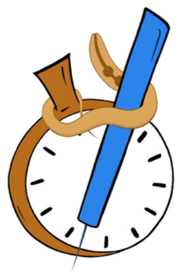

# AssayTimer

**An offline, browser-based timer and data logger for *C. elegans* gentle touch assays.**

**[Open the app → (https://dv-welp.github.io/touch-assay-timer/)]**

Works in any browser, on any touchscreen device. On a phone, use "Add to Home Screen" to install it like an app.

## Why this exists

The gentle touch assay was run by hand — a separate timer, a tally counter, a paper notebook, then manual spreadsheet entry before you can plot anything. This app replaces all of that: it times the stimuli, records each response, and exports a plot-ready spreadsheet.

  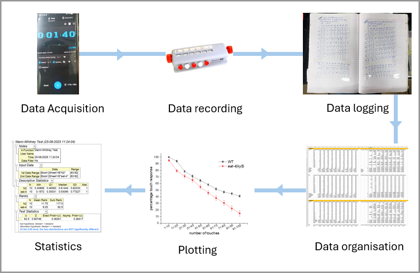
  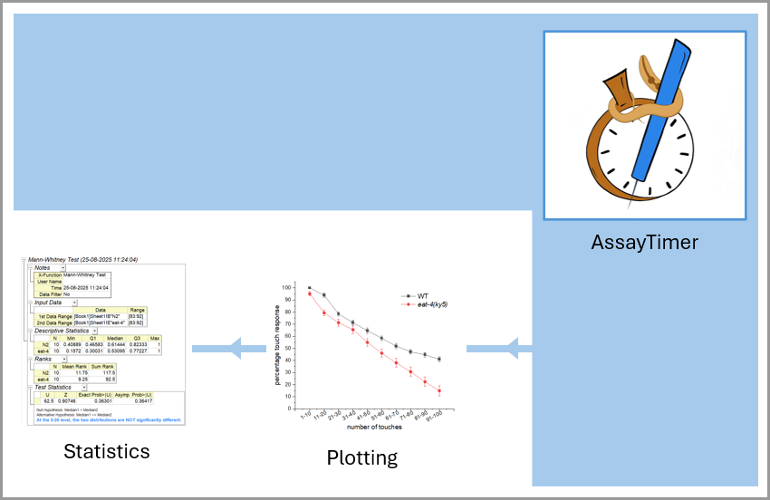

Before: timer, tally counter, notebook, manual entry &nbsp;→&nbsp; After: the app handles acquisition and logging

  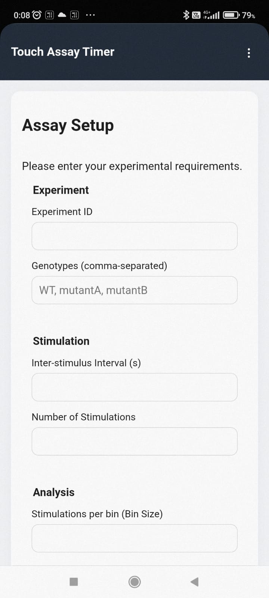
  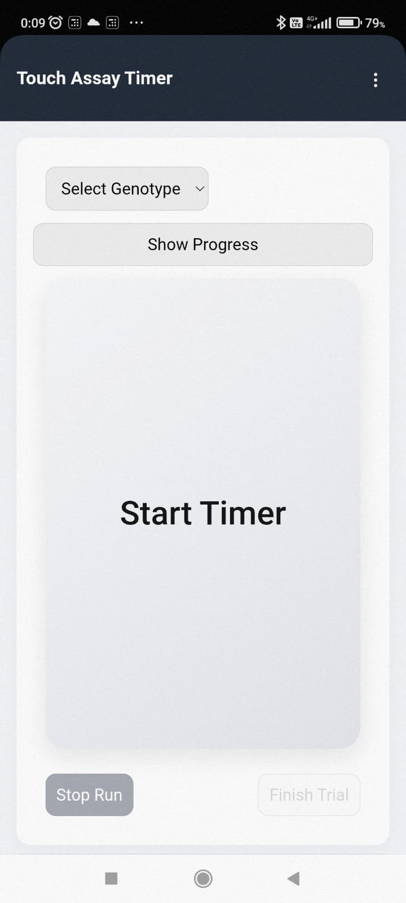
  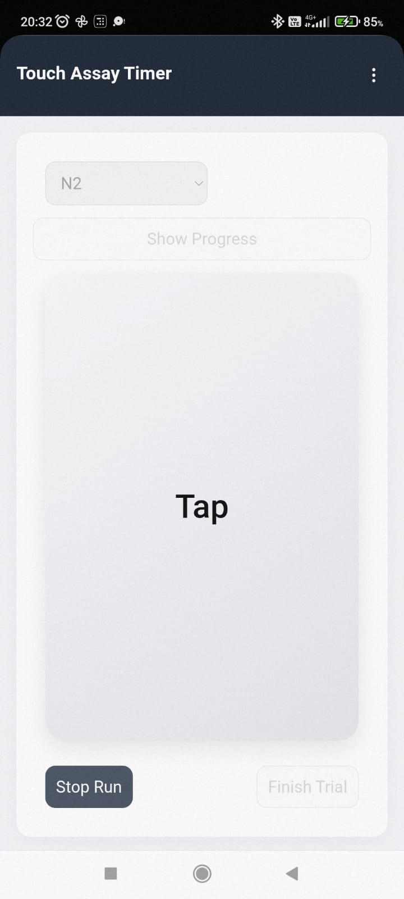
  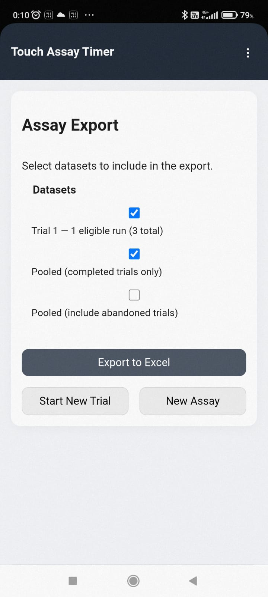
  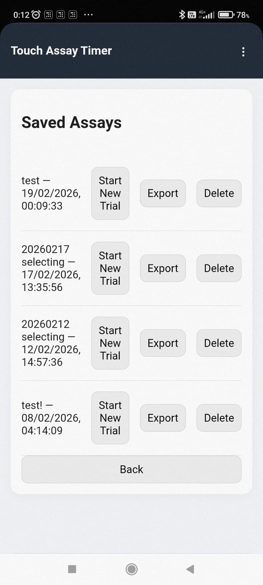

Setup · Timer · Tap · Export · Saved assays

## How it works

1. **Set up** your assay: genotypes, ISI, number of stimulations, and bin size.
2. **Select a genotype** and press **Start Timer**. The app emits a cue for each stimulus interval (ticks, voice, or a mix of both; see Settings).
3. **Tap** when the animal does not respond. No tap within the interval is recorded as a response (1); a tap is recorded as no response (0).
4. Press Start Timer again for the next animal. There is no cap on animals per sitting, and you can switch genotypes freely.
5. **Finish the trial** (one sitting), then **export** to Excel. Come back any time to start a new trial, re-export, or delete.

Each animal is one *run* and each sitting is one *trial*. The in-app instructions explain how assays, trials and runs fit together.

Runs with fewer recorded values than the total stimulation count are marked ineligible for analysis, which is useful for discarding animals that leave the field.

## Export

One `.xlsx` workbook per export, with separate sheets for each trial's **raw data** and **analysed data**, plus **pooled** sheets across trials.

- **Raw:** everything recorded, always preserved.
- **Analysed:** binned responses with mean and SEM, ready to paste into Origin, Prism, Excel, or R.
- **Pooled:** the same analysis across multiple trials (completed trials only by default; abandoned trials can be included optionally).

  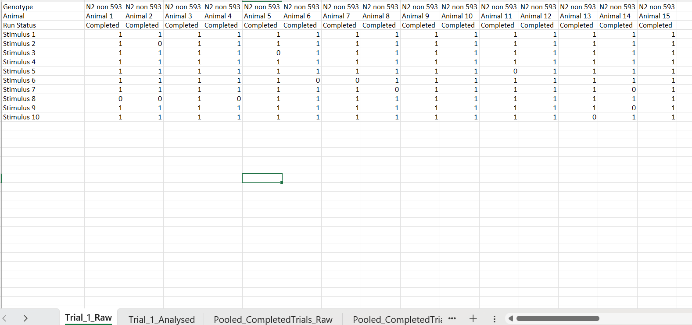
  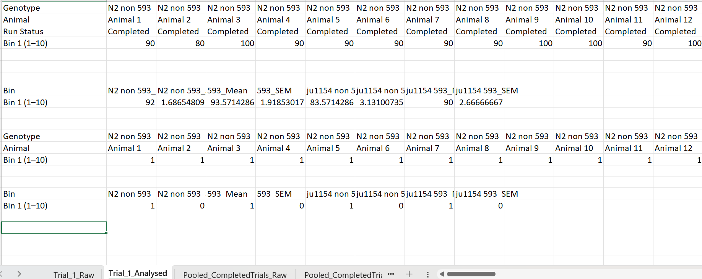
  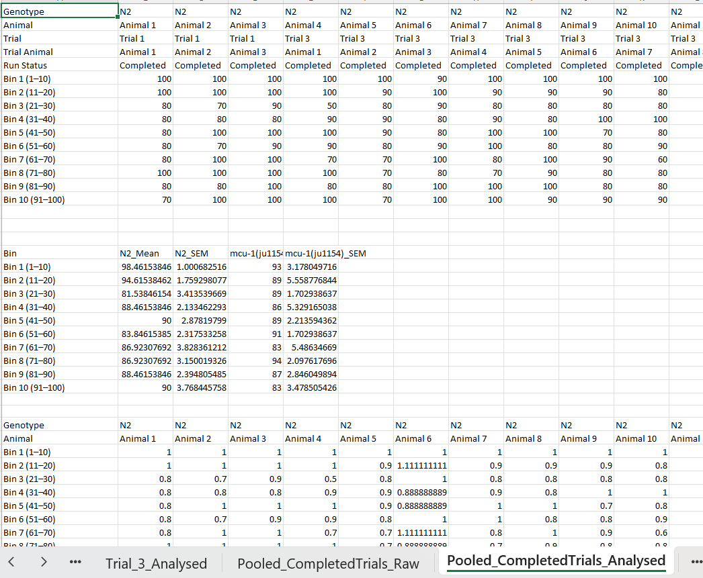

## Reliability

- **Crash-safe:** data is saved to IndexedDB after every interval, asynchronously so it never interferes with a running assay. Trials interrupted without being finished are kept as *abandoned* trials.
- **Read-only raw data:** once recorded, raw data is never modified.
- **Explicit analysis rules:** anything excluded from analysis (ineligible runs, abandoned trials, a partial final bin) is flagged and visible, and you choose whether to include it.
- **Offline:** no internet connection needed after the first load, and data stays on your device.

## Roadmap

- Version 2.0: plotting and statistical analysis (R/Python)
- Suggestions and issues are welcome.

## License

MIT. See [LICENSE](LICENSE).

## Author

Devyani Vadawale
